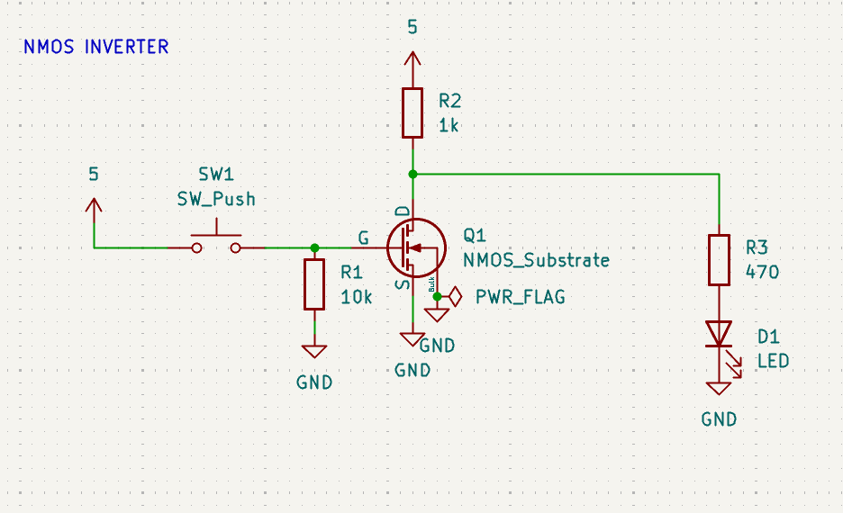
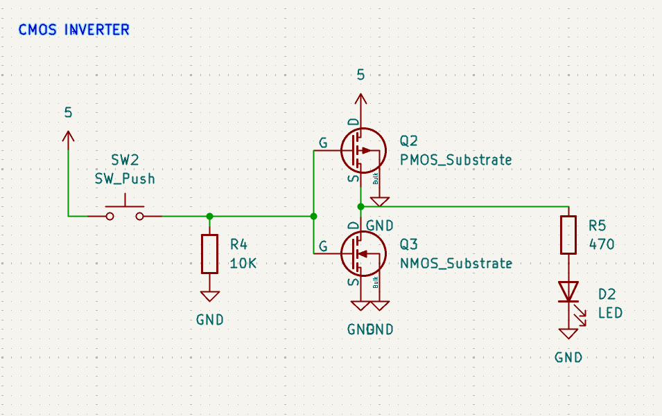

# CMOS Logic
CMOS logic is essential because it helps decrease power consumption when the switch is on or off. The only time a CMOS driven switch consumes power is during the change between the on and off stages. 

## NMOS inverter 

## CMOS inverter

___
CMOS inverter doesn't ever waste power because the PMOS and NMOS take turns turning off so the path from 5V to gnd is always blocked. Replacing the resistor with PMOS ensures zero power loss. 